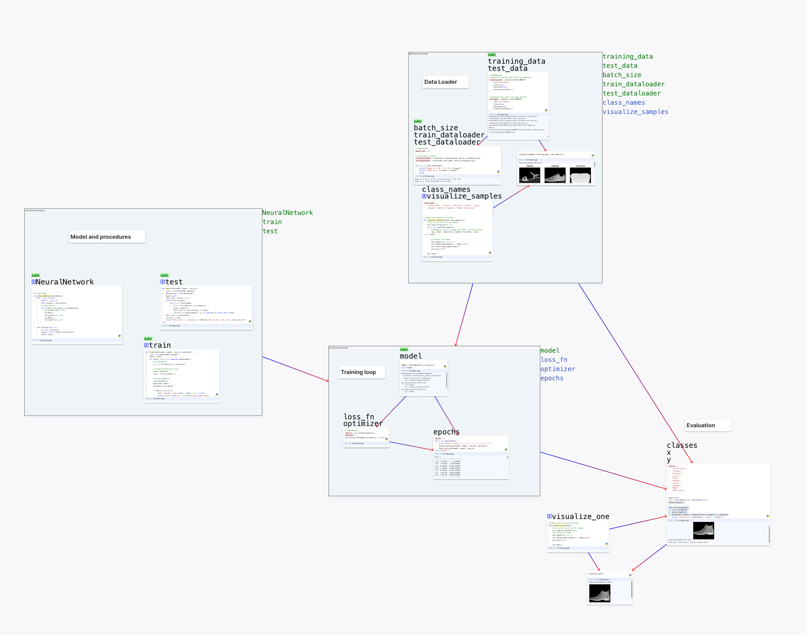

# CodePod app user manual

CodePod is a web app. The test server is at https://test.codepod.io. You can
login with your Google account and start using it right away. All code are saved
in the cloud and executed in the cloud runtimes.

This manual describes all the Operations and User Interface for the app.

### Creating pods

Right click on the canvas, then click "python". This will create a python pod at the position of clicking.

<!--  -->

### Pod toolbar

When you hover on the pod, the toolbar will show on the top right corner.

### Moving pods

Option 1: There's a grab icon on the toolbar. Drag on it will move the pod.

Option 2: You can also drag to select one or more pod and move them at once.

Special note for scope: if you want to "drag-to-select" a scope, you need to drag from outside into it. If you drag inside a scope, only inner nodes will be selected.

### Deleting a pod

In the pod toolbar, there's a delete pod button to delete a pod.

### Moving around the Canvas

If you're using a touchpad

- swiping with two fingers can move your view on the Canvas
- pinch with two fingers to zoom in and out

If you're using a mouse

- click and hold the middle button can drag the Canvas
- scroll to zoom in and out

### Run a pod

First, you need to start the runtime. In the runtime section of the sidebar,
click the start button in python. The kernel will start and will be in "idle"
status when it's ready.

If it's your first time using the app, a user volume will be created for you
when you start your first runtime, therefore, it will take up to 1 minute for
the kernel to be available. Future kernels should be started within 5 seconds.

The kernel will be shutdown in 24 hours.

Once the kernel is ready, you can click the run button on the pod toolbar to run
the code. Like Jupyter notebook, the results will be displayed under the code.

You can also use `shift-enter` keyboard shortcut to trigger the code execution.

Unlike Jupyter, you can safely close the page while the pod is running. The results will be continuely populated in the cloud.

### User volume

The runtime kernel is a cloud container. The container will be re-recreated when the runtime restarts, so the files in the container are deleted. Each repository has a separate runtime container that doesn't share files.

To persist data files, there's a user volume mounted at `/mnt/data` where you can store your files that need to persist across kernel restarts and across repo. This user volume is a NFS volume, therefore the IO performance is much slower compared to local disk on the container.

### Creating a scope

You can drag on canvas to select multiple pods. Then right click on the
selection, and choose "create scope". A scope will be created.

When you drag to move the scope, all sub-nodes are moved together.

The drag-to-select behavior on scope is slightly different. You have to drag
from outside of a scope to select the scope. Dragging inside the scope will
select nodes in the scope.

### Removing a scope

In the scope's toolbar, click "remove scope" to remove the scope but keeps its children.

To remove the scope and all its children, click "remove scope and children".

### Copy and paste a scope

To copy a scope, click on the "copy" button in the scope toolbar.

To paste a scope, right click on the canvas and choose paste. The scope will be pasted into the right click position.

You can copy and paste scopes across repositories. It will overwrite your system clipboard.

### Move a pod into and out of a scope

Dragging the pods won't change the scoping, but there will be visual marks to highlight problems:

- If two pods overlap, their borders turn pink.
- If a pod is moved out of its scope, the pod and the scope borders will trun
  orange.

To actually move a pod into a scope, you can first move it in place, then click the "change scope" button on the toolbar (in the dropdown menu).

To move a pod out of a scope, you can first move it out then click the "change scope" button on the toolbar.

### Run a scope with topological order

You can run a scope by clicking the run button on the toolbar. The execution
order is the topological order w.r.t. the def-use edges and manual edges. That
is, if there's an edge from a to b, a will be executed before b. In case of
cycle, the cycle point is silently skipped.

### Drawing an edge

There's a edge icon in a pod's toolbar. Drag on it and drop onto another pod
will create an edge. This edge can be used to mark the execution order. For example, you can draw edges of a chain of pods and run the chain to simulate a Jupyter notebook.

### Def-use visualization

If a pod defines variables, functions, or classes, the defined symbols will be shown in the top-left corner.

If a pod calls a function defiend in another pod, there will be an edge from the definition to the callsite.

The def-use edges are only visualized inside the scope to avoid cluttering the view.

### Scope semantics

Not only can you organize pods with scopes, they also have semantic meanings to
help you isolate namespaces in the runtime.

First of all, scopes are separated. The function `foo` in one scope is different
from the `foo` in another. A function is only visible inside the scope
(including its children).

Second, you can export a function out into its parent. This is the use case
where inner scope implements some lower-level functions, and expose a public API
to higher level. You can mark a pod as public by clicking on the "toggle public"
button. The pod will be visually marked "public".

### Rich text pod (markdown)

You can create a rich text pod by right clicking on the canvas and selecting
"Note". This is a notion-like WYSIWYG editor with markdown syntax support. You
can write notes and documents in this editor.

### Import a Jupyter notebook

Right click on the Canvas and select "Import", then choose your jupyter notebook file. The notebook will be imported into a scope and layout horizontally.

### (Best?) Practices to order the pods

- put logical related code pods into a scope
- use nested scopes to build a hierarchy:
  - inner scope represents lower level functions
  - outer scope represents higher level functions.
  - inner scope expose APIs into outer scope
- use def-use edges to layout the pods. E.g., order the pods so that edges flow from top-left to bottom-right.

